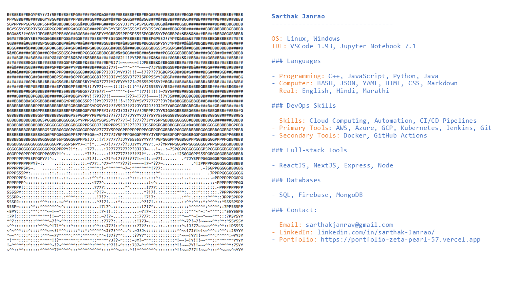

<h1 align="center">My Portfolio</h1>

  <a href="https://portfolio-zeta-pearl-57.vercel.app/">Sarthak Janrao</a>

<!-- MasterHead -->

<!-- Onclick functionality -->

  

<h3 align="center"> ☁️ Software Development Aspirant | 🔒 Full Stack Developer | 🚀 AI & Machine Learning Enthusiast </h3>

Eager to learn and embrace emerging technologies to build efficient and impactful solutions.

<!-- 📏 LINE -->

## Snake Eating My Contribution Graph

  

<!-- 📏 LINE -->

<!-- Languages and Tools -->
<h3 align="left">Languages and Tools</h3>

  
  
  
  
  
  
  
  
  
  
  
  
  
  
  
  
  

<!-- 📏 LINE -->

<h3 align="left">Now Playing</h3>

  

<!-- 📏 LINE -->

<!-- JavaScript -->

